<div align="center">
  
# 📊 Aman Shah
  
### *Data Scientist | ML Engineer | AI Storyteller*
  


[](https://www.linkedin.com/in/aman-shah-392616373/)
[](mailto:iamanshah21@gmail.com)
[](YOUR_PORTFOLIO)
[](https://github.com/amanshah362)
[](https://www.kaggle.com/amanshah32)

</div>

---

## 🧬 The Data Scientist's Mindset

```python
class Scientist:
    def __init__(self):
        self.name = "Aman Shah"
        self.role = "Junior Data Scientist"
        self.mission = "Extract wisdom from data, build solutions that transform lives"
        
        self.skills = {
            'Languages': ['Python', 'SQL'],
            'ML/DL': ['TensorFlow', 'PyTorch', 'Scikit-learn', 'Keras'],
            'Data Tools': ['Pandas', 'NumPy', 'NLTK'],
            'Visualization': ['Power BI', 'Matplotlib', 'Plotly', 'Seaborn'],
            'Development': ['FastAPI', 'Docker', 'Git']
        }
        
        self.current_quest = [
            "Mastering MLOps & Model Deployment",
            "Building Production-Grade AI Systems",
            "Exploring Generative AI"
        ]
        
        self.philosophy = "Data is the new oil, but without analysis, it's just crude."
```

---

## 🎯 What Makes Me Different

| Domain | Expertise |
|--------|-----------|
| 🧠 **Data Storytelling** | Transforming raw numbers into compelling business narratives |
| 🤖 **ML Engineering** | Building end-to-end pipelines from data ingestion to deployment |
| 📈 **Business Analytics** | Data-driven decision making with real-world impact |
| 🔬 **Research Mindset** | Constant experimentation and innovation |
| 🎯 **Problem Solving** | Tackling complex challenges with systematic approaches |

---

## 💻 Tech Stack Visualization

<p align="center">
  <!-- Deep Learning Frameworks -->
  
  
  
  
  <!-- ML Libraries -->
  
  
  
  <!-- Data Science Stack -->
  
  
  
  
</p>

<p align="center">
  <!-- Development & Deployment -->
  
  
  
  
  
  
  <!-- Databases -->
  
  
  
  <!-- Visualization -->
  
  
</p>

---

## 🌟 Featured Projects Showcase

<table>
  <tr>
    <td width="50%">
      <h3 align="center">❤️ Heart Disease Prediction</h3>
      <div align="center">
        
        
      </div>
      <p align="center">
        <i>End-to-end ML pipeline for early heart disease detection using patient health metrics. Deployed with FastAPI.</i>
      </p>
      <p align="center">
        <a href="#">🔗 Live Demo</a> • <a href="#">📂 Source Code</a>
      </p>
    </td>
    <td width="50%">
      <h3 align="center">🎬 Movie Recommendation System</h3>
      <div align="center">
        
        
      </div>
      <p align="center">
        <i>Hybrid recommendation engine combining content-based & collaborative filtering with NLP for movie descriptions.</i>
      </p>
      <p align="center">
        <a href="#">🔗 Live Demo</a> • <a href="#">📂 Source Code</a>
      </p>
    </td>
  </tr>
  <tr>
    <td width="50%">
      <h3 align="center">😀 Real-Time Sentiment Analysis</h3>
      <div align="center">
        
        
      </div>
      <p align="center">
        <i>BERT-based sentiment classifier for social media monitoring with real-time dashboard visualization.</i>
      </p>
      <p align="center">
        <a href="#">🔗 Live Demo</a> • <a href="#">📂 Source Code</a>
      </p>
    </td>
    <td width="50%">
      <h3 align="center">🎥 Deepfake Detection System</h3>
      <div align="center">
        
        
      </div>
      <p align="center">
        <i>CNN-based deepfake detection using transfer learning with MobileNet architecture for video authenticity.</i>
      </p>
      <p align="center">
        <a href="#">🔗 Live Demo</a> • <a href="#">📂 Source Code</a>
      </p>
    </td>
  </tr>
</table>

---


---

## 🏆 Certifications & Achievements

<p align="center">
  
  
  
  
</p>

---

## 📈 Current Learning Journey

```mermaid
graph LR
    A[Python Fundamentals] --> B[Data Analytics]
    B --> C[Machine Learning]
    C --> D[Deep Learning]
    D --> E[NLP]
    E --> F[LLM & LangChain]
    F --> G[Agentic AI & LangGraph]
    
    style A fill:#1a1a2e,stroke:#00D4FF,stroke-width:2px,color:#00D4FF
    style B fill:#1a1a2e,stroke:#FF6B6B,stroke-width:2px,color:#FF6B6B
    style C fill:#1a1a2e,stroke:#4ECDC4,stroke-width:2px,color:#4ECDC4
    style D fill:#1a1a2e,stroke:#45B7D1,stroke-width:2px,color:#45B7D1
    style E fill:#1a1a2e,stroke:#96CEB4,stroke-width:2px,color:#96CEB4
    style F fill:#1a1a2e,stroke:#FFD93D,stroke-width:2px,color:#FFD93D
    style G fill:#1a1a2e,stroke:#FF6B6B,stroke-width:3px,color:#FF6B6B
```




## 🌍 Connect & Collaborate

<p align="center">
  <a href="www.linkedin.com/in/aman-shah-392616373/">
    
  </a>
  <a href="mailto:iamanshah21@.com">
    
  </a>
  <a href="YOUR_PORTFOLIO">
    
  </a>
  <a href="https://www.kaggle.com/amanshah32">
    
  </a>
</p>

---

## 💬 Quote That Drives Me

> *"In God we trust. All others must bring data."*  
> — **Dr.W. Edwards Deming**

---

<div align="center">

### 🚀 *From Data to Insights, From Insights to Impact*

**Aman Shah — Data Scientist**

</div>
